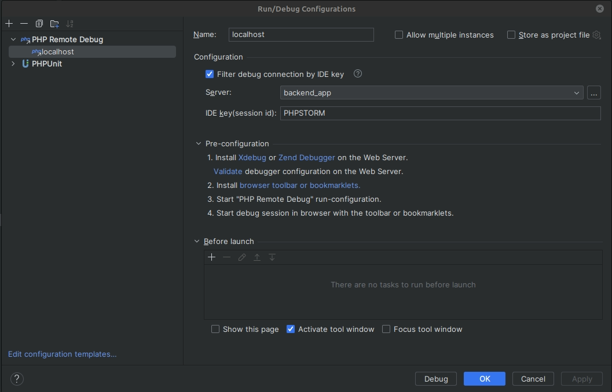

# Project docker configuration

Docker-compose file contains:

* **"backend_app"** container. It is main container to run PHP.
* **"schedule"** docker container is copy of "backend_app" container. "schedule" needs to run
```php artisan schedule:run``` command.
* **"queue"** docker container is copy of "backend_app" container. "queue" needs to run
```php artisan horizon``` command.
* local and staging environment contains **mailpit** docker container. mailpit uses to send email locally.

## Prepare local environment

* You should install **docker, ansible, make**.
  * For Ubuntu: ```sudo bash bash/install-ubuntu.sh```.
  * For Linux Mint: ```sudo bash bash/install-mint.sh```.
* Run ```sudo usermod -a -G docker $USER```.
You need **reboot** system, after running the command.

## Usage guide

* You can run the project using ```make local-up``` command.
* You can connect to backend_app container using ```make local-bash``` command.

## Fresh start

* Create **.vault-password-local** file with password for local environment
* Clone app repository to **/app** folder
* Run command ```make local-init``` to init config files
* Run command ```make local-up``` to run docker containers
* Run command ```make app-composer-install``` to install vendor dependencies
* Run command ```make app-create-database``` to create fresh database
* Run command ```make local-bash``` to connect to backend_app container and apply migration
* Run migrations ```php artisan october:migrate```
* Fill database with fake data ```php artisan shopaholic:generate.fake.data```

## Command list

Generate docker-compose file, .env files, nginx configuration and etc.
```bash
make local-init {inventory=production}
```

Run docker containers
```bash
make local-up
```

Stop docker containers
```bash
make local-stop
```

Connect to backend_app container
```bash
make local-bash
```

Connect to backend_app container and apply migrations
```bash
make app-migrate
```

Connect to backend_app container and install composer install vendor dependencies
```bash
make app-composer-install
```

Connect to backend_app container and create app_db database
```bash
make app-create-database
```

Connect to backend_app container and apply dump file. You should copy the dump file to **temp/db/dump.sql**
```bash
make app-apply-dump
```

## xDebug configuration

* Open **/app** folder with app code in PHPStorm
* Go to File -> Settings -> PHP
* Choose or create new CLI interpreter


* Add Debug configuration "PHP Remote debug"



* Add Server configuration


